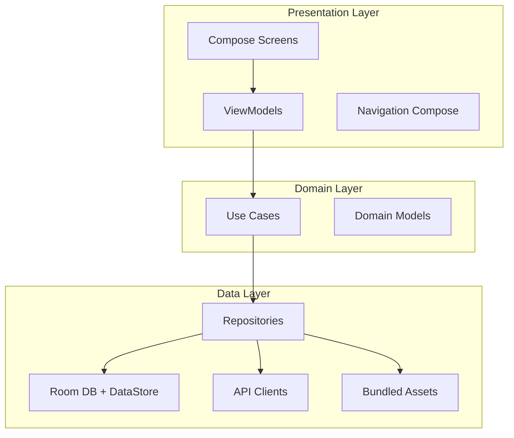
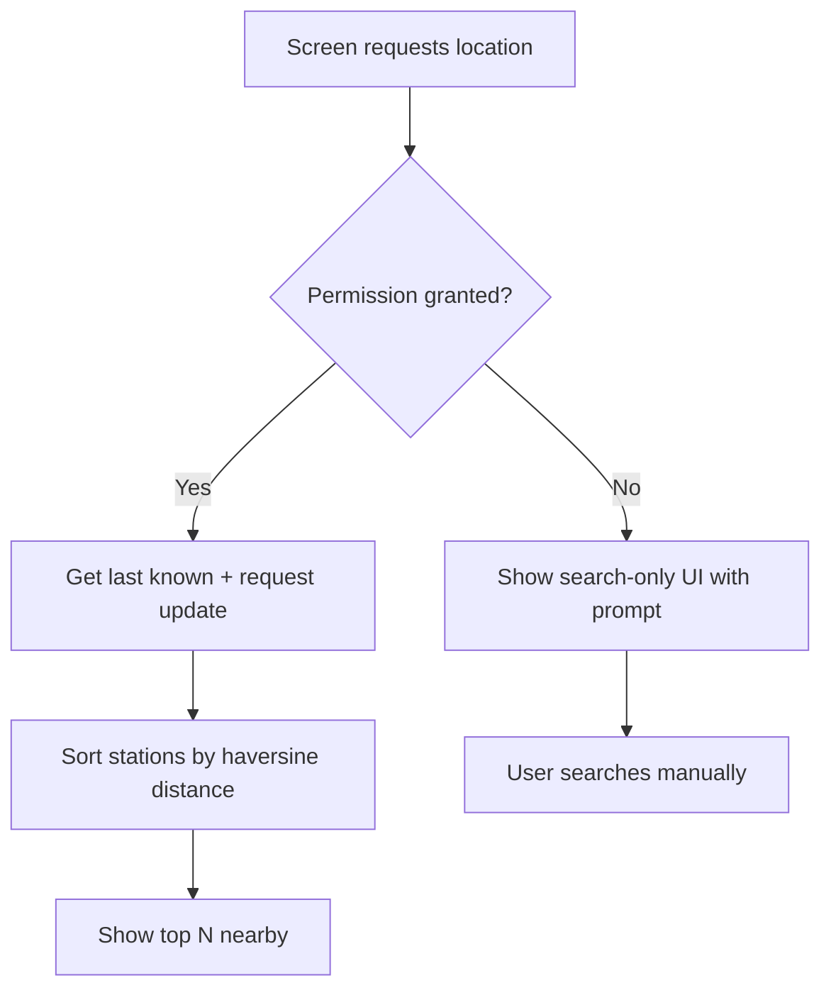
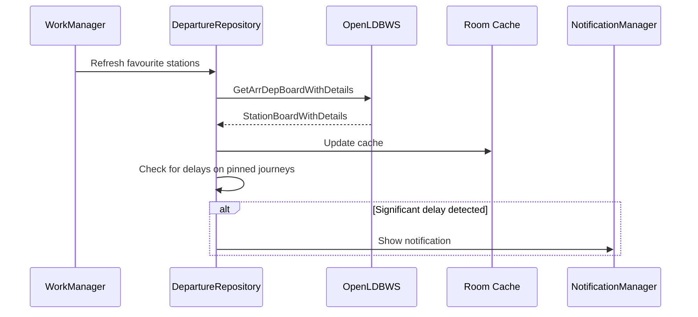
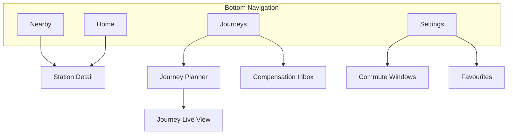

# Architecture

Technical architecture for the UK Rail Tracker Android app.

## Layer overview



## Package structure

```text
com.ukrailtracker.app/
├── ui/
│   ├── theme/              # existing neon theme
│   ├── navigation/         # NavHost, bottom bar, routes
│   ├── home/               # M2 contextual home
│   ├── nearby/             # M1 nearby stations
│   ├── station/            # M1 station detail + departures
│   ├── journey/            # M3 journey planner + tracking
│   ├── compensation/       # M7 disruption inbox
│   └── settings/           # commute windows, favourites
├── domain/
│   ├── model/              # Station, Departure, Journey, Disruption
│   ├── repository/         # Repository interfaces (no Android imports)
│   └── usecase/            # GetNearbyStations, GetDepartures, etc.
├── data/
│   ├── local/
│   │   ├── db/             # Room database, DAOs, entities
│   │   └── datastore/      # Preferences, favourites, commute windows
│   ├── remote/
│   │   ├── darwin/         # OpenLDBWS (GetArrDepBoardWithDetails), KB, RTJP, HSP
│   │   └── dto/            # Feed-specific response models (never in ui/)
│   ├── repository/         # *RepositoryImpl — Darwin primary, TransportAPI fallback
│   └── mapper/             # DTO/XML → domain model conversions
├── location/               # LocationProvider wrapper
└── worker/                 # WorkManager background refresh
```

## Key dependencies (M0)

| Library | Purpose |
|---------|---------|
| `androidx.navigation:navigation-compose` | Multi-screen navigation |
| `androidx.lifecycle:lifecycle-viewmodel-compose` | ViewModels |
| `org.jetbrains.kotlinx:kotlinx-coroutines-android` | Async operations |
| `androidx.room:room-runtime` + `room-ktx` | Local SQLite database |
| `androidx.datastore:datastore-preferences` | User preferences, favourites |
| `com.squareup.retrofit2:retrofit` + Gson/Moshi converter | HTTP API client |
| `com.google.android.gms:play-services-location` | GPS location |
| `androidx.work:work-runtime-ktx` | Background refresh |

---

## Room database schema

### `stations` table

Imported from bundled `stations.xml` on first launch.

| Column | Type | Notes |
|--------|------|-------|
| `crs_code` | TEXT PK | e.g. `"PAD"` |
| `name` | TEXT | Display name |
| `latitude` | REAL | For distance calc |
| `longitude` | REAL | For distance calc |
| `operator_name` | TEXT | e.g. `"Great Western Railway"` |
| `operator_code` | TEXT | e.g. `"GW"` |
| `address_json` | TEXT | Serialised address object |
| `accessibility_json` | TEXT | Serialised accessibility data |
| `station_map_url` | TEXT | Nullable |
| `min_connection_time` | INTEGER | Minutes |

Index: `(latitude, longitude)` for bounding-box nearby queries.

### `departure_cache` table

Short-lived cache for offline display.

| Column | Type | Notes |
|--------|------|-------|
| `id` | INTEGER PK AUTO | |
| `crs_code` | TEXT | Station CRS |
| `board_type` | TEXT | `"arrdep"` (primary), or `"departure"` / `"arrival"` if split |
| `data_json` | TEXT | Serialised board (from `GetArrDepBoardWithDetails` parse) |
| `fetched_at` | INTEGER | Epoch millis |
| `filter_crs` | TEXT | Nullable; mirrors OpenLDBWS `filterCrs` when used |

TTL: 5 minutes while online; serve stale up to 30 minutes when offline.

### `journey_log` table

Written by M3/M6, read by M7.

| Column | Type | Notes |
|--------|------|-------|
| `id` | INTEGER PK AUTO | |
| `date` | TEXT | ISO date |
| `origin_crs` | TEXT | |
| `destination_crs` | TEXT | |
| `operator_code` | TEXT | For Delay Repay rules |
| `scheduled_departure` | TEXT | ISO datetime |
| `scheduled_arrival` | TEXT | ISO datetime |
| `actual_arrival` | TEXT | ISO datetime, nullable |
| `delay_minutes` | INTEGER | Calculated |
| `was_cancelled` | BOOLEAN | |
| `service_id` | TEXT | API service identifier |
| `claim_status` | TEXT | `"eligible"`, `"claimed"`, `"dismissed"`, `"not_eligible"` |

---

## DataStore preferences

| Key | Type | Purpose |
|-----|------|---------|
| `favourite_stations` | StringSet | CRS codes |
| `favourite_journeys` | String | JSON array of `{origin, destination}` pairs |
| `commute_windows` | String | JSON array of `{days, startTime, endTime, stationCrs}` |
| `stations_db_version` | Int | Trigger re-import when asset changes |
| `notification_enabled` | Boolean | M8 |
| `background_refresh_interval` | Int | Minutes (default 15) |

---

## Repository pattern

Repository **interfaces** live in `domain/repository/`; **implementations** in `data/repository/`. ViewModels and use cases depend on interfaces only — never on Darwin DTOs or XML parsers.

Darwin is the primary live feed ([data-sources.md §1](data-sources.md#1-overview--sources-features-and-layering)). Train movement uses OpenLDBWS **`GetArrDepBoardWithDetails`**. TransportAPI can implement the same repository interfaces as a dev/fallback. UI rework touches `ui/` and ViewModel `UiState` mapping only.

```kotlin
// domain/repository/ — illustrative
interface StationRepository {
    suspend fun getAllStations(): List<Station>
    suspend fun getStationByCrs(crs: String): Station?
    suspend fun getNearbyStations(lat: Double, lng: Double, limit: Int): List<StationWithDistance>
    suspend fun searchStations(query: String): List<Station>
}

interface DepartureRepository {
    suspend fun getDepartures(crs: String, forceRefresh: Boolean = false): DepartureBoard
    fun observeDepartures(crs: String): Flow<DepartureBoard>
}
```

### Caching strategy

| Data | Cache location | TTL | Offline fallback |
|------|---------------|-----|------------------|
| Station metadata | Room | Permanent (re-import on asset update) | Always available |
| Departure boards | Room `departure_cache` | 60 s (foreground), 15 min (background) | Serve stale up to 30 min |
| Disruptions | In-memory + DataStore | 5 min | Show last-known with staleness badge |
| Journey options | None (always fresh) | — | Show error |
| Journey log | Room | Permanent | Always available |

---

## Location handling



- Use Fused Location Provider (Play Services) for battery efficiency
- Request `ACCESS_COARSE_LOCATION` minimum; `ACCESS_FINE_LOCATION` for better accuracy
- Never send location to a server — all processing on-device
- Show permission rationale dialog before system prompt

### Distance calculation

Haversine formula on station lat/lng vs user lat/lng. No need for a spatial DB extension at 2,612 stations — linear scan with bounding-box pre-filter is fast enough.

---

## Background refresh (M2+)



- `PeriodicWorkRequest` every 15 minutes
- Constraints: `NetworkType.CONNECTED`
- Respect battery saver: skip if `PowerManager.isPowerSaveMode`
- User can disable in Settings

---

## Navigation structure



---

## Error handling

| Scenario | UI response |
|----------|-------------|
| No network | Show cached data with "Last updated X min ago" banner |
| API rate limit (429) | Show cached data; retry with exponential backoff |
| API error (5xx) | Error card with retry button |
| Empty departure board | "No departures scheduled" empty state |
| Location denied | Search-only mode with permission prompt in Settings |
| Station not found | "Station not found" with search suggestion |

---

## Privacy

| Data | Stored where | Sent to server? | Retention |
|------|-------------|-----------------|-----------|
| GPS location | In-memory only | No | Discarded after nearby sort |
| Favourites / commute windows | DataStore (on-device) | No | Until user deletes |
| Journey log | Room (on-device) | No | 56 days (configurable) |
| Departure cache | Room (on-device) | No | 30 min TTL |
| API keys | BuildConfig | Yes (in API request headers) | N/A |

No user accounts in v1. No analytics SDK in v1 (add later with consent).

---

## Testing strategy

| Layer | Approach | Milestone |
|-------|----------|-----------|
| Repositories | Unit tests with fake DAO + mock API | M0 |
| Use cases | Unit tests with fake repositories | M1 |
| ViewModels | Unit tests with fake use cases + coroutine test rule | M1 |
| UI | Compose UI tests for critical flows | M8 |
| Integration | MockWebServer for API client tests | M0 |

Critical test flows:

1. Nearby sort returns closest station given fixed GPS coordinates
2. Departure board maps API response to domain model correctly
3. Journey log records delay and flags as claimable per operator rules
4. Offline mode serves cached departures with staleness indicator
