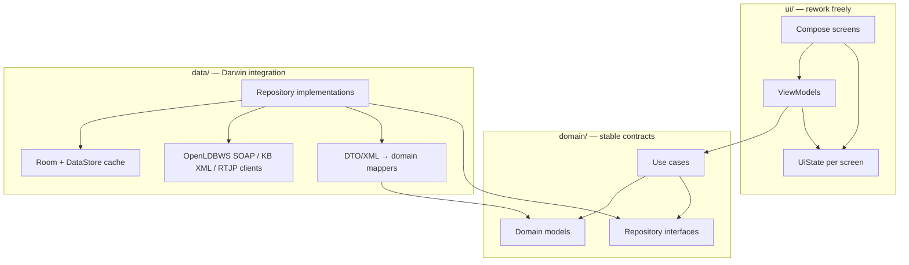
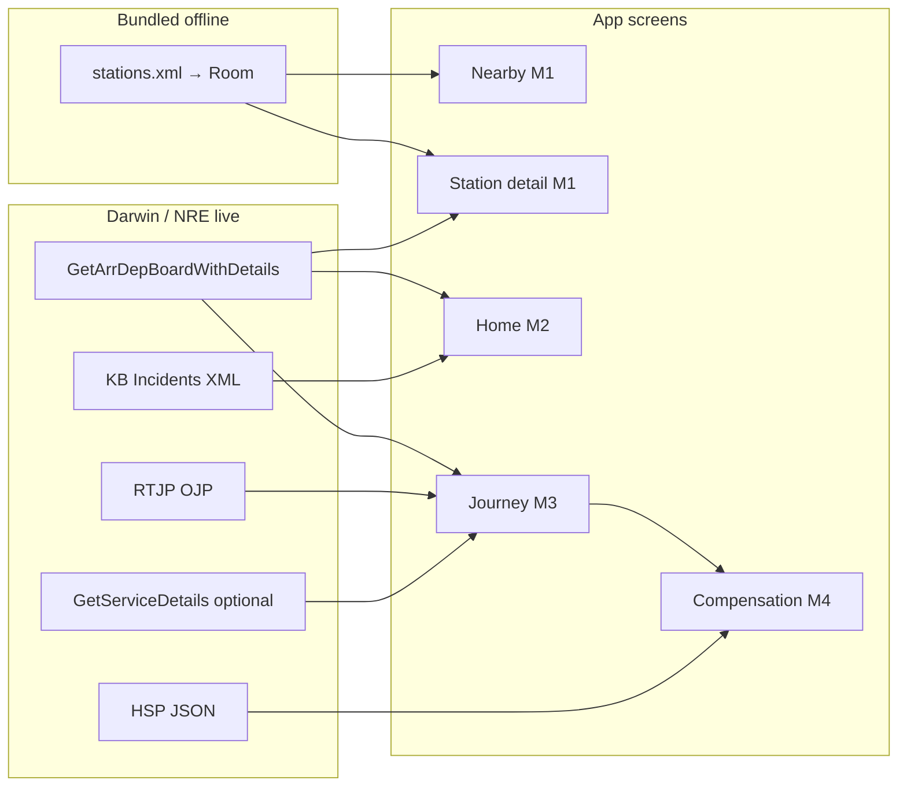

# Data Sources

Live rail data providers, credential setup, endpoint mapping, and how feeds connect to the app’s data layers.

---

## 1. Overview — sources, features, and layering

### 1.1 Primary strategy: Darwin (National Rail)

**Darwin** is the authoritative UK live-running engine and the chosen primary source for this app. Register via the [Rail Data Marketplace](https://www.nationalrail.co.uk/developers/) ([Darwin data feeds](https://www.nationalrail.co.uk/developers/darwin-data-feeds/)).

Static station metadata stays **bundled locally** (`stations.xml` → Room). Live data is fetched from Darwin-family feeds and mapped into **domain models** before any UI sees it.

| Data need | Primary Darwin / NRE feed | Fallback | Milestone |
|-----------|---------------------------|----------|-----------|
| Station metadata (name, CRS, lat/lng, accessibility) | Bundled `stations.xml` (from Knowledgebase Stations XML) | — | M0+ |
| Live train movements (arrivals + departures + per-service calling points) | **OpenLDBWS** `GetArrDepBoardWithDetails` (SOAP) | Cached last-known in Room | M1+ |
| Single-service deep detail (when board payload is insufficient) | OpenLDBWS `GetServiceDetails` | — | M3 (optional) |
| Journey planning (A→B, realtime) | **RTJP Webservice** (OJP) | — | M3 |
| Disruptions / incidents | **Knowledgebase Incidents XML** or **OJP Disruptions Webservice** | Cached last-known | M2+ |
| Historic journey performance (delay minutes, cancellation) | **Historic Service Performance (HSP)** JSON | Local `journey_log` from M3 tracking | M4 |
| Full national movement stream | **Darwin Push Port** (STOMP/XML) | — | Backlog (server-side only) |
| Static timetables | **Darwin Timetable** push feed | RTJP planned times | M3 (optional) |

**Not recommended for direct mobile integration:**

| Feed | Why skip on-device |
|------|-------------------|
| **Darwin Push Port** | Continuous high-volume XML stream; needs a consumer that maintains Darwin state. NRE’s own mobile apps use webservices, not Push Port. |
| **Darwin Timetable** push | Same pattern — bulk ingest, not per-screen polling. |

Use Push Port only if you later add a **backend sync service** (out of scope for v1).

**Development fallback:** [TransportAPI](https://www.transportapi.com/) — REST JSON, quick to prototype while Darwin marketplace access is pending. See [Option B — TransportAPI (fallback)](option-b-transportapi-fallback) below. Swap implementations behind repository interfaces; UI unchanged.

### 1.2 Layer separation (UI rework without breaking data)

Data sources are consumed only inside the **data layer**. Screens never import Darwin DTOs, SOAP clients, or XML shapes.



**Dependency rule:** `ui` → `domain` ← `data`. Domain has no Android or Compose imports.

| Layer | Knows about Darwin? | Responsibility |
|-------|-------------------|----------------|
| `ui/` | No | Render `UiState`; emit user events |
| `domain/model/` | No | `Station`, `Departure`, `Journey`, `Disruption` |
| `domain/repository/` | No | `DepartureRepository`, `DisruptionRepository`, … |
| `domain/usecase/` | No | Orchestration, Delay Repay rules, commute weighting |
| `data/remote/darwin/` | Yes | OpenLDBWS SOAP client, KB XML, RTJP, HSP |
| `data/remote/dto/` | Yes | `StationBoardWithDetailsDto`, SOAP response models, … |
| `data/mapper/` | Yes | DTO/XML → domain model |
| `data/repository/` | Yes | Cache TTL, offline fallback, which feed to call |

**Per-feed package layout (M0):**

```text
data/
├── remote/
│   ├── darwin/
│   │   ├── OpenLdbWsApi.kt        # GetArrDepBoardWithDetails (+ GetServiceDetails)
│   │   ├── KnowledgebaseApi.kt    # Incidents / engineering XML
│   │   ├── RtjpApi.kt             # Real-time journey planner (OJP)
│   │   └── HspApi.kt              # Historic service performance
│   └── dto/                       # Feed-specific shapes only
├── mapper/
│   ├── ArrDepBoardWithDetailsParser.kt  # SOAP → StationBoardWrite / domain
│   └── IncidentsToDisruption.kt
└── repository/
    ├── DepartureRepositoryImpl.kt # implements domain interface
    └── ...
```

**UiState mapping** happens in ViewModels (presentation formatting), not in repositories:

```kotlin
// domain — feed-agnostic
data class Departure(
    val destination: String,
    val scheduledTime: Instant,
    val estimatedTime: Instant?,
    val platform: String?,
    val status: TrainStatus,
    val delayMinutes: Int?,
)

// ui — safe to delete when redesigning
data class DepartureRowUi(
    val timeLabel: String,       // "08:42"
    val destinationLabel: String,
    val statusLabel: String,     // "On time", "+4 min"
    val statusKind: StatusKind,  // maps to theme colours in Composable
)
```

To rework the neon dashboard into a different layout, change `ui/` and ViewModel mapping. `DepartureRepository` and Darwin clients stay untouched.

See [architecture.md](architecture.md) for Room schema, caching TTLs, and testing strategy.

### 1.3 Endpoint → feature mapping



---

## Option A: Darwin (National Rail Open Data) — primary

**Portal**: https://opendata.nationalrail.co.uk/ / [Rail Data Marketplace](https://www.nationalrail.co.uk/developers/)  
**Support**: [Open Rail Data Talk](https://groups.google.com/g/openraildata-talk) (community; NRE does not offer formal support)

### Why Darwin

- Authoritative CIS-aligned running data (same engine as station screens and NRE apps)
- Free tier: SOAP APIs up to **5 million requests per 4-week railway period**; push feeds unlimited
- Rich surface: LDB, service details, RTJP, disruptions, historic performance
- Attribution to National Rail required ([brand guidelines](https://www.nationalrail.co.uk/developers/darwin-data-feeds/))

### Registration

1. Create account on the Rail Data Marketplace.
2. Subscribe to feeds (enable as needed per milestone):

| Subscribe when | Feed | Marketplace name |
|----------------|------|------------------|
| M1 | Darwin Webservice (Public) / OpenLDBWS | Live Departure Boards SOAP — includes `GetArrDepBoardWithDetails` |
| M2 | Knowledgebase Incidents XML | Service Disruption (via Knowledgebase) |
| M3 | RTJP Webservice | Real Time Journey Planner |
| M3 (optional) | Same OpenLDBWS | `GetServiceDetails` when board-embedded details are not enough |
| M4 | Historic Service Performance (HSP) | HSP JSON API |
| Later | Darwin Push Port | Only with a backend consumer |

3. Copy API credentials from **My Feeds** (OpenLDBWS uses an **AccessToken** in the SOAP header — `TokenValue`).
4. Store in `android/local.properties` (gitignored):

```properties
DARWIN_LDB_TOKEN=your_token_from_my_feeds
# Add other keys if RTJP/OJP / HSP use separate credentials
```

5. Expose via `BuildConfig` in `app/build.gradle.kts`:

```kotlin
android {
    defaultConfig {
        buildConfigField("String", "DARWIN_LDB_TOKEN",
            "\"${project.findProperty("DARWIN_LDB_TOKEN") ?: ""}\"")
    }
    buildFeatures { buildConfig = true }
}
```

**Never** pass `BuildConfig` values into Composables or domain models — only into `data/remote/` client factories.

### Primary train-movement call: `GetArrDepBoardWithDetails`

**Docs**: [OpenLDBWS](https://lite.realtime.nationalrail.co.uk/OpenLDBWS/) · [Wiki](https://wiki.openraildata.com/index.php/GetArrDepBoardWithDetails)  
**Endpoint**: `https://lite.realtime.nationalrail.co.uk/OpenLDBWS/ldb11.asmx` (use the version listed on your My Feeds / current WSDL — historically `ldb9`–`ldb11`)

Returns a **`StationBoardWithDetails`**: public arrivals **and** departures for a CRS within a time window, **including service details** (calling points, delays, cancellation reasons) on each row.

| Parameter | Type | Notes |
|-----------|------|-------|
| `numRows` | int | Services to return (API max is small — typically ≤10; request what the UI needs) |
| `crs` | string(3) | Station CRS, e.g. `PAD` |
| `filterCrs` | string(3)? | Optional origin/destination filter |
| `filterType` | `"from"` \| `"to"` | How `filterCrs` is applied (default `"to"`) |
| `timeOffset` | int | Minutes offset from now (−120…120) |
| `timeWindow` | int | Minutes ahead relative to offset (−120…120) |

**Why this call (not plain `GetDepartureBoard`):**

- One request covers arrivals + departures for station detail and home cards
- “WithDetails” embeds calling-point / movement detail — enough for M1–M2 boards and most M3 “my train” views without a second round-trip
- `filterCrs` + `filterType` support commute A→B filtering (e.g. home board filtered `to` work CRS)

**Data-layer mapping:**

```text
OpenLdbWsApi.GetArrDepBoardWithDetails
  → SourcePayload (SOAP XML)
  → ArrDepBoardWithDetailsParser
  → StationBoardWrite (entities for departure_cache)
  → DepartureRepository reads domain DepartureBoard / ArrivalBoard
```

Use `GetServiceDetails` only when the user pins a service and you need a full refresh of that RID after it has left the board window.

### Feed → repository mapping

| Feed | Transport | Repository interface | Domain output |
|------|-----------|---------------------|---------------|
| OpenLDBWS `GetArrDepBoardWithDetails` | XML SOAP | `DepartureRepository` (arrivals + departures) | `StationBoard` / `DepartureBoard` |
| OpenLDBWS `GetServiceDetails` | XML SOAP | `ServiceRepository` | `ServiceDetails` |
| RTJP Webservice | SOAP/XML | `JourneyRepository` | `List<JourneyOption>` |
| KB Incidents XML | XML REST | `DisruptionRepository` | `List<Disruption>` |
| HSP JSON | JSON REST | `HistoricServiceRepository` | `HistoricServiceRecord` |
| Bundled asset | Local file | `StationRepository` | `Station` |

Optional TransportAPI / Huxley implementations must still parse into the **same** `StationBoard` write model.

### Key operations by milestone

#### M1 — Station detail + nearby

| Operation | Feed | Notes |
|-----------|------|-------|
| Live board for CRS | **`GetArrDepBoardWithDetails`** | Poll while screen visible; cache 30–60 s; `numRows` ≈ 10 |
| Filter to a destination | same call + `filterCrs` / `filterType=to` | Useful for “trains toward my usual destination” |
| Station static info | Room from `stations.xml` | Never fetch Stations XML at runtime in v1 |

#### M2 — Contextual home + disruption banner

| Operation | Feed | Notes |
|-----------|------|-------|
| Boards for favourite / commute stations | **`GetArrDepBoardWithDetails`** | WorkManager background refresh; prefer filtered boards where commute pair is known |
| Active disruptions | KB **Incidents XML** (service disruption) | Poll every 5 min; map to `Disruption` domain model |
| National overview (optional) | KB NSI XML | “X% of services on time” headline |

#### M3 — Journey tracking A→B

| Operation | Feed | Notes |
|-----------|------|-------|
| Journey options with realtime | **RTJP Webservice** | OJP engine; accounts for delays/cancellations |
| Live status at origin / along route | **`GetArrDepBoardWithDetails`** | Prefer `filterCrs` for the destination; poll 30–60 s while pinned |
| Deep service refresh | `GetServiceDetails` | Only if RID is no longer on the board or extra fields are needed |
| Route disruption | KB Incidents or OJP Disruptions Webservice | Highlight affected legs |

#### M4 — Compensation inbox

| Operation | Feed | Notes |
|-----------|------|-------|
| Completed journey delay proof | **HSP JSON** | Historic right-time / delay metrics |
| In-app journey log | Room `journey_log` | Written during M3 live tracking |
| Operator rules | Bundled config | [compensation-guide.md](compensation-guide.md) — not a network feed |

### Integration notes

- **`GetArrDepBoardWithDetails` is the default train-movement path** for boards and per-service calling points.
- Parse SOAP XML only in `data/parse` / `data/mapper` — never in Composables.
- Prefer OkHttp + hand-built SOAP envelope (or a thin wrapper) over a heavyweight SOAP stack on Android; keep the AccessToken out of logs.
- **Rate / volume**: poll while foregrounded; 15 min background for favourites; board responses are larger than plain boards — cache the parsed store, not raw XML, where possible.
- **Attribution**: show “Powered by National Rail” in Settings / About per NRE developer guidelines.

### Push Port (backlog only)

Darwin Push Port delivers gzip-compressed XML over STOMP/OpenWire. It is designed for systems that **replicate Darwin state** (ticket retail, journey planners, CIS). For a passenger Android app:

- Use **`GetArrDepBoardWithDetails` + RTJP + KB** for on-demand requests.
- Add Push Port only if you build a server that ingests the stream and exposes a thin API to the app — not worth the operational cost for v1.

---

## Option B: TransportAPI (fallback)

**URL**: https://www.transportapi.com/

### When to use

- Darwin marketplace approval is delayed (see risk register in [milestone-roadmap.md](milestone-roadmap.md))
- Local development without NRE credentials
- Contract testing of repository interfaces before Darwin mappers exist

### Registration

1. Sign up at https://www.transportapi.com/signup
2. Add to `android/local.properties`:

```properties
TRANSPORTAPI_APP_ID=your_app_id
TRANSPORTAPI_APP_KEY=your_app_key
```

3. Implement `TransportApiDepartureRepository : DepartureRepository` alongside `DarwinLdbDepartureRepository` — inject one via DI/factory.

### Key endpoints

| Endpoint | Maps to repository | Milestone |
|----------|-------------------|-----------|
| `GET /v3/uk/train/station/{crs}/live.json` | `DepartureRepository` | M1 |
| `GET /v3/uk/train/service/{id}/json` | `ServiceRepository` | M3 |
| `GET /v3/uk/train/journey/{from}/{to}/json` | `JourneyRepository` | M3 |
| `GET /v3/uk/train/service_alerts.json` | `DisruptionRepository` | M2 |

Free tier is limited (~30 requests/day per endpoint — verify current plan). Not suitable as production primary if Darwin is available.

---

## Option C: Huxley (self-hosted Darwin proxy)

**URL**: https://github.com/jpsingleton/Huxley

JSON REST wrapper around Darwin OpenLDBWS SOAP. Use only if SOAP on-device is too painful and you accept hosting a proxy. Prefer calling **`GetArrDepBoardWithDetails`** directly (or via Huxley’s equivalent board-with-details route) and still parse into the same Room write model.

---

## Bundled station data (`stations.xml`)

**Location**: repo root [`stations.xml`](../stations.xml)  
**Format**: JSON (despite `.xml` extension)  
**Records**: 2,612 UK stations  
**Source**: National Rail Knowledgebase Stations XML (bundled once, not fetched live)

### Key fields per station

| Field | Type | Use |
|-------|------|-----|
| `crsCode` | String | Darwin / LDB lookups (e.g. `"PAD"`) |
| `name` | String | Display |
| `location.latitude` / `location.longitude` | Double | Nearby sort, distance calc |
| `stationOperator.name` | String | Operator display, Delay Repay rules |
| `stationOperator.operatorCode` | String | Operator code mapping |
| `address` | Object | Station detail screen |
| `stationAccessibility` | Object | Accessibility-first filter (M1.1) |
| `stationMap.url` | String | Station map image |
| `minimumConnectionTime` | Int | Journey planning connection buffer |

### Import strategy (M0)

1. Copy `stations.xml` to `android/app/src/main/assets/stations.json`
2. On first launch, parse JSON and insert into Room `stations` table
3. Create spatial index on `(latitude, longitude)` for fast nearby queries
4. Set a `db_version` flag in DataStore; re-import only when asset version changes

---

## Credential security checklist

- [ ] API keys in `local.properties` only — listed in `.gitignore`
- [ ] Exposed via `BuildConfig` fields, read only in `data/remote/` — not in `ui/` or `domain/`
- [ ] Release builds use same keys (or separate prod keys in CI secrets)
- [ ] No keys in log output (strip from OkHttp logging interceptor in release)
- [ ] Document key setup in this file; never commit actual values

---

## Decision log

| Date | Decision | Rationale |
|------|----------|-----------|
| 2026-08-02 | Bundle `stations.xml` locally | 2,612 stations fit in APK; no API calls for static data |
| 2026-08-02 | TransportAPI as primary live data source for v1 | Faster to integrate; free tier sufficient for development |
| 2026-08-02 | Darwin as future upgrade path | Richer disruption data; evaluate when M2 disruption features need it |
| 2026-08-02 | **Darwin as primary live data source** | Authoritative NRE data; OpenLDBWS + RTJP + KB + HSP cover all milestones |
| 2026-08-02 | **Strict data/UI layering** | Repository interfaces + domain models isolate Darwin DTOs/XML from Compose |
| 2026-08-02 | **TransportAPI as dev/fallback impl** | Same repository interfaces; swap while awaiting marketplace access |
| 2026-08-02 | **No Push Port in v1 Android app** | Stream feed needs server-side consumer; LDB polling sufficient for passenger UX |
| 2026-08-03 | **`GetArrDepBoardWithDetails` for train movement** | Single OpenLDBWS call returns arrivals, departures, and embedded service details for boards / tracking |
