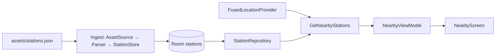

# M0 + M1 Nearby — Implementation Plan

Plan to deliver **M0 foundation** needed for nearby stations, plus **partial M1**: use bundled station coordinates and phone GPS to show the closest station(s). Deploy to emulator and physical phone.

Parent docs: [milestone-roadmap.md](milestone-roadmap.md) · [architecture.md](architecture.md) · [data-sources.md](data-sources.md)

---

## Scope

### In this slice

| Deliverable | Milestone |
|-------------|-----------|
| Bundle `stations.xml` → Room with lat/lng | M0 |
| Location permission + GPS wrapper | M0 |
| Bottom nav shell (Nearby live; others placeholder) | M0 |
| Nearby screen: sorted by distance, highlight closest | M1 (partial) |
| Optional: static station detail (name, CRS, operator, address) | M1 (partial) |
| Deploy to emulator + physical phone | Deploy |

### Out of scope (defer)

- Darwin OpenLDBWS / `GetArrDepBoardWithDetails`
- Live departure board on station detail
- DataStore favourites / commute windows
- WorkManager background refresh
- Full Home / Journeys / Settings behaviour

Those become the remainder of M0/M1 after Nearby is proven on device.

---

## Architecture for this slice



**Layer rules** (see [data-sources.md §1.2](data-sources.md#12-layer-separation-ui-rework-without-breaking-data)):

- Composables only see `NearbyUiState` / events
- Domain: `Station`, `StationWithDistance`, `StationRepository`, `GetNearbyStationsUseCase`
- Data: asset source, JSON parser, Room store — no Compose imports
- Location: `LocationProvider` interface; Play Services only in the impl

---

## Phase 0 — Dependencies & project wiring

**Effort:** ~0.5 day

1. Add to `android/app/build.gradle.kts`:
   - Room (+ KSP), Navigation Compose, lifecycle-viewmodel-compose, coroutines
   - Play Services Location
   - (Optional this slice) DataStore for `stations_db_version` gate
2. Manifest:
   - `ACCESS_COARSE_LOCATION` + `ACCESS_FINE_LOCATION`
   - Keep existing neon theme / edge-to-edge
3. Package skeleton under `com.ukrailtracker.app`:

```text
domain/model/
domain/repository/
domain/usecase/
data/source/
data/parse/
data/store/
data/local/db/
data/repository/
location/
ui/nearby/
ui/navigation/
ui/station/          # optional static detail
```

**Done when:** `./gradlew :app:assembleDebug` succeeds with new dependencies.

---

## Phase 1 — Stations ingest (M0 data)

**Effort:** ~1–1.5 days

1. Copy repo-root [`stations.xml`](../stations.xml) → `android/app/src/main/assets/stations.json` (file content is JSON despite the `.xml` name).
2. Room schema (subset of [architecture.md](architecture.md)):

| Column | Type | Notes |
|--------|------|-------|
| `crs_code` | TEXT PK | e.g. `PAD` |
| `name` | TEXT | Display name |
| `latitude` | REAL | Nearby sort |
| `longitude` | REAL | Nearby sort |
| `operator_name` | TEXT | List subtitle |
| `operator_code` | TEXT | e.g. `GW` |
| `address_json` | TEXT | Optional for static detail |

Index on `(latitude, longitude)` for bounding-box prefilter.

3. Ingest pipeline:
   - `SourceId.BUNDLED_STATIONS`
   - `AssetDataSource` → `StationsJsonParser` → `StationStore.replaceAll`
4. Run ingest on first launch (or when asset / `stations_db_version` changes).
5. Domain models: `Station`, `StationWithDistance(station, metres)`.
6. `StationRepository`:
   - `suspend fun getNearby(lat: Double, lng: Double, limit: Int): List<StationWithDistance>`
   - `suspend fun search(query: String): List<Station>`
   - `suspend fun getByCrs(crs: String): Station?`

**Algorithm:** bounding-box prefilter around user lat/lng, then haversine distance, sort ascending, take `limit` (default 10).

**Done when:**

- [ ] Unit test: fixed coords near Paddington (`51.517`, `-0.177`) → `PAD` in top results
- [ ] App launches offline; Room contains ~2,612 stations (log count after import)

---

## Phase 2 — Location (M0)

**Effort:** ~0.5–1 day

```kotlin
interface LocationProvider {
    suspend fun currentLocation(): UserLocation?  // lat, lng, accuracyMetres
}
```

1. Implement with Fused Location Provider (last-known + short high-accuracy update).
2. Permission UI flow:
   - Show rationale → system prompt
   - **Granted** → run nearby sort
   - **Denied** → search-only / “Enable location” empty state (no crash)

**Done when:** Grant and deny paths both work; emulator with mock GPS returns a non-null location.

---

## Phase 3 — Nearby UI (M1 partial)

**Effort:** ~1 day

1. Navigation: bottom bar **Home | Nearby | Journeys | Settings** — only Nearby is fully implemented; others are placeholders.
2. `GetNearbyStationsUseCase(locationProvider, stationRepository, limit = 10)`.
3. `NearbyUiState`:
   - Loading / needs permission / error / content
   - Content: closest station callout + list rows (`name`, `crs`, `distanceLabel`, `operator`)
4. `NearbyScreen` (neon theme):
   - Header: **Closest: Name (CRS) · distance**
   - `LazyColumn` of other nearby stations
   - Pull-to-refresh or refresh action: re-read GPS + re-query Room
5. Optional: tap row → `StationDetailScreen` with static fields only (no live board).

**Done when:** Compose preview works with fake `NearbyUiState`; Composables do not import Room or Play Services.

---

## Phase 4 — Emulator deploy

**Effort:** ~0.5 day

From `android/`:

```bash
./gradlew :app:assembleDebug :app:installDebug

# Start AVD if needed (name from android/docs — Pixel 8 Pro)
emulator -avd ukrail_pixel8pro_api35 -netdelay none -netspeed full &

adb wait-for-device
adb shell am start -n com.ukrailtracker.app/.MainActivity
```

### Mock GPS near known stations

```bash
adb emu geo fix -0.177 51.517
```

Or Extended Controls → Location → set lat/lng, then refresh in-app.

| Place | Latitude | Longitude | Expect near top |
|-------|----------|-----------|-----------------|
| Paddington | 51.517 | -0.177 | PAD |
| King's Cross | 51.532 | -0.123 | KGX |
| Bristol Temple Meads | 51.449 | -2.580 | BRI |

### Emulator acceptance

- [ ] Import completes; Nearby shows stations within a few seconds
- [ ] After `geo fix`, closest station matches the table (top 1–3)
- [ ] Permission deny path works
- [ ] No fatal logcat for `com.ukrailtracker.app`

```bash
adb logcat | grep -i ukrailtracker
adb -s emulator-5554 emu kill   # when finished
```

---

## Phase 5 — Physical phone deploy

**Effort:** ~0.5 day

1. Enable Developer options → USB debugging; accept RSA prompt.
2. Confirm device:

```bash
adb devices   # expect "device"
```

3. Install and launch:

```bash
./gradlew :app:installDebug
adb shell am start -n com.ukrailtracker.app/.MainActivity
```

4. Grant location when prompted; prefer outdoors or near a real station.
5. Confirm closest station is geographically sensible (top 3 within ~1–2 km of your position).

**Indoor GPS tip:** if accuracy is poor, walk outside or use a mock-location app. Product safety net remains top-5 list + later search.

```bash
./gradlew :app:uninstallDebug
```

### Phone acceptance

- [ ] App installs and opens on device
- [ ] Location permission flow works
- [ ] Nearby list populates with plausible distances
- [ ] Closest station matches local geography when outdoors

---

## Task checklist (execute in order)

| ID | Task | Done when |
|----|------|-----------|
| T1 | Gradle deps + Room/KSP + Location | `assembleDebug` green |
| T2 | Manifest location permissions | Installable build |
| T3 | Asset copy + Station entity / DAO / DB | Compiles |
| T4 | Asset ingest pipeline on first launch | Log shows ~2612 stations |
| T5 | Haversine + `getNearby` + unit test | Paddington test passes |
| T6 | `LocationProvider` + permission UI | Grant/deny both work |
| T7 | Nav shell + Nearby screen | Closest + list visible |
| T8 | Emulator install + `geo fix` PAD/KGX | Correct closest |
| T9 | Phone install + real GPS smoke | Sensible nearest station |
| T10 | (Optional) Static station detail on tap | Name / CRS / operator / address |

### Implementation status (2026-08-03)

| ID | Status | Notes |
|----|--------|-------|
| T1–T7 | Done | Layers + Nearby UI shipped in app |
| T8 | Done | Emulator `geo fix -0.177 51.517` → **London Paddington (PAD · 61 m)** |
| T9 | Done | Installed on physical Pixel 8 Pro; import logged **2612 stations** |
| T10 | Done | Static station detail route wired from Nearby taps |

---

## Success criteria (slice complete)

1. Cold start **offline**: stations imported and available from Room.
2. With location: **closest station** plus top ~10 by distance.
3. Emulator with mock coordinates matches expected CRS (PAD / KGX / BRI).
4. Physical phone shows a plausible nearest station.
5. UI has no knowledge of JSON assets or Play Services types — only `NearbyUiState`.

---

## Day-to-day commands

```bash
cd android
./gradlew :app:assembleDebug
./gradlew :app:installDebug
adb shell am start -n com.ukrailtracker.app/.MainActivity
./gradlew :app:uninstallDebug
adb logcat | grep -i ukrailtracker
adb emu geo fix -0.177 51.517
```

---

## Next after this slice

1. ~~Wire OpenLDBWS **`GetArrDepBoardWithDetails`** behind `DepartureRepository`~~ — done (M1 remainder)
2. ~~Station detail live board + pull-to-refresh / staleness~~ — done
3. ~~Search across all stations; recent searches DataStore~~ — done
4. Finish remaining M0 placeholders (Home / Journeys / Settings behaviour) — M2+
5. Favourites DataStore + WorkManager background refresh — M2

### M1 remainder status (2026-08-03)

| Deliverable | Status |
|-------------|--------|
| OpenLDBWS `GetArrDepBoardWithDetails` + Room `departure_cache` | Done |
| Station detail live board + refresh + stale badge | Done |
| Accessibility + station map from bundled asset | Done |
| Station search by name/CRS + recent searches | Done |
| Requires `DARWIN_LDB_TOKEN` in `android/local.properties` | Setup |
