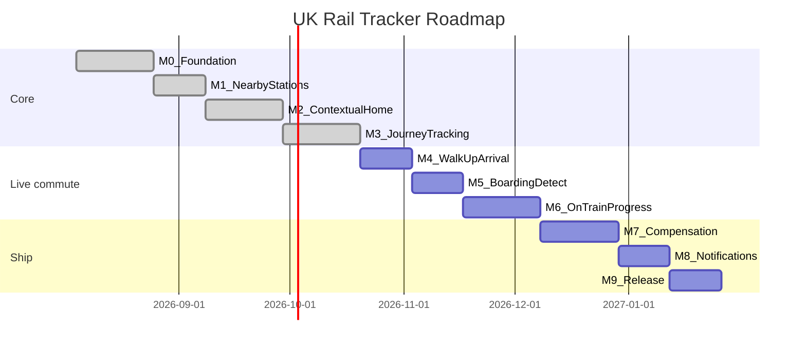
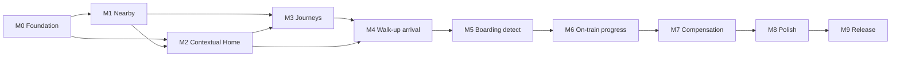

# Milestone Roadmap

Phased delivery plan for UK Rail Tracker. Each milestone produces a shippable debug build. Effort estimates assume solo, part-time development (~10–15 hours/week).

## Timeline overview

**Estimated total**: ~5–6 months to feature-complete v1.0.

---

## Feature priority map

| # | Feature | Milestone | Priority |
|---|---------|-----------|----------|
| — | Foundation (data, API, navigation) | M0 | Prerequisite |
| 1 | Nearest stations + detail + departures | M1 | P0 |
| 2 | Usual stations at this time + disruption + trains | M2 | P0 |
| 3 | Typical journeys A→B with live delay/disruption | M3 | P1 |
| 4 | Walk-up arrival at station → trains to favourites (next hour) | M4 | P0 |
| 5 | Detect boarding via GPS + confirm service | M5 | P0 |
| 6 | On-train progress, ETA refresh, arrival buzz | M6 | P0 |
| 7 | Past disrupted journeys for compensation | M7 | P1 |
| — | Notifications and polish | M8 | P2 |
| — | Play Store release | M9 | P2 |

---

## M0 — Foundation

**Duration**: ~2–3 weeks  
**Goal**: Data and app skeleton that all features build on.

### Deliverables

- [ ] Import `stations.xml` → bundled asset → Room database with lat/lng spatial index
- [ ] API client abstraction (Retrofit or Ktor) with repository pattern
- [ ] API keys via `local.properties` → `BuildConfig` (never committed)
- [ ] Navigation shell: bottom nav with placeholder screens (Home, Nearby, Journeys, Settings)
- [ ] Location service wrapper: foreground permission, last-known location, permission-denied fallback
- [ ] DataStore for favourites: saved stations, saved journey pairs
- [ ] Shared UI components: loading, error, empty states in neon theme
- [ ] Add dependencies: Navigation Compose, ViewModel, coroutines, Room, DataStore, WorkManager

### Acceptance criteria

- [ ] App launches offline and can search/filter the full station list
- [ ] Tapping a station shows static detail from local DB (name, CRS, address, operator)
- [ ] Live departures API call succeeds for a hard-coded CRS code (e.g. `PAD`)
- [ ] Location permission flow works: grant → nearby sort; deny → manual search only
- [ ] `./gradlew :app:assembleDebug` succeeds with new dependencies

---

## M1 — Nearest stations + station detail

**Duration**: ~2 weeks  
**Priority**: P0  
**User story**: *"Show me the nearest stations, let me pick one, and see what's going on there."*

### Screens

| Screen | Behaviour |
|--------|-----------|
| **Nearby** | Stations sorted by GPS distance; show name, CRS, distance, operator; refresh on location update |
| **Station detail** | Static info (address, accessibility, station map URL, operator) + live departure board (next 10–15 departures: destination, time, platform, status, delay minutes) |
| **Search** | Filter all 2,612 stations by name or CRS code; recent searches persisted |

### Acceptance criteria

- [x] Standing at or near a real station, it appears in the top 3 nearby results
- [x] Departure board shows live data with correct delay/cancel indicators
- [x] Pull-to-refresh updates the board; stale data shows timestamp
- [x] Station detail renders accessibility info from bundled data
- [x] Search finds stations by partial name (e.g. "Kings" → King's Cross)

### Sub-milestone M1.1 (optional)

- Accessibility-first filter: step-free stations only, accessible toilets, etc.

---

## M2 — Contextual "my stations now"

**Duration**: ~2–3 weeks  
**Priority**: P0  
**User story**: *"When I open the app at my usual commute time, show me my stations, any disruption, and the next trains."*

### Features

| Feature | Behaviour |
|---------|-----------|
| **Routine inference (v1)** | User-defined commute windows (e.g. Mon–Fri 07:30–09:00 → Home station) + favourites weighted by time/day |
| **Home screen** | Surface 1–3 likely stations with disruption banner (green / amber / red) |
| **Departures at a glance** | Per station: next 3–5 trains with delay/cancel chips |
| **Disruption summary** | Tap banner → affected operators + board-derived detail (cancellations / max delay) |
| **Background refresh** | WorkManager polls every 15 min on network available |

### Acceptance criteria

- [x] At 08:15 on a configured weekday, home screen shows the user's morning station
- [x] Active disruption at that station shows amber/red banner with summary text
- [x] Next trains match live departure board data
- [x] User can add/edit commute windows in Settings
- [x] App refreshes home data in background without being open

> **Note (M2 v1):** Disruption severity is derived from `GetArrDepBoardWithDetails` (cancellations / delays). A dedicated incidents feed can replace this later.

### Sub-milestone M2.1 (optional)

- Android home-screen widget: next departures for primary commute station

---

## M3 — Journey tracking A→B

**Duration**: ~3 weeks  
**Priority**: P1  
**User story**: *"I travel between two stations regularly — show me the typical journeys, live status, and any delays or disruption."*

### Screens

| Screen | Behaviour |
|--------|-----------|
| **Journey planner** | Pick origin + destination (favourites, recents, search); show service options for chosen time |
| **Journey detail** | Per-leg: scheduled vs estimated arrival, platform, calling points, delay propagation |
| **Disruption on route** | Highlight cancelled legs, delays >15 min, missed-connection risk |
| **"My train" pin** | User selects a service; app tracks it with 30–60 s polling until arrival |

### Acceptance criteria

- [x] Plan a journey (e.g. Paddington → Bristol Temple Meads) and see 3+ service options
- [x] Live journey view updates estimated times while screen is open
- [x] Cancelled or significantly delayed leg is visually flagged
- [x] Pinned service persists across app background/foreground
- [x] Recent journeys saved and accessible from Journeys tab

> **Note (M3 v1):** Journey options use OpenLDBWS `GetArrDepBoardWithDetails` with `filterCrs` / `filterType=to` (direct / through services only). Full multi-leg planning via RTJP can replace this later. Unpinning writes a `journey_log` row for M7.

### Sub-milestone M3.1 (optional)

- Platform predictions based on historical patterns
- Share journey status link ("Running 12 min late")
- RTJP multi-leg journey planner

---

## M4 — Walk-up arrival → favourite destinations

**Duration**: ~2 weeks  
**Priority**: P0  
**Depends on**: M1 (GPS + nearby), M2 (favourites / commute context), M3 (filtered boards + journey duration)  
**User story**: *"When I walk up to a station, notice that I've arrived on foot and show me which trains go to my favourite stations in the next hour, and how long each trip will take."*

### Features

| Feature | Behaviour |
|---------|-----------|
| **Walk-up arrival detection** | Detect approaching a station **on foot**: GPS path nears a station geofence at walking pace, then dwells inside it (not drive-by, not already on a train). Lock that CRS as current origin |
| **Walk vs non-walk filter** | Ignore brief proximity at vehicle / train speeds; require sustained pedestrian speed into the station footprint before declaring arrival |
| **Favourite-bound departures** | For each favourite destination, query next-hour services from current station (`filterCrs` / `filterType=to`); exclude past departures |
| **Journey duration** | Per option: scheduled/estimated travel time to the favourite (departure → arrival at filter station from calling points / board detail) |
| **Home / arrival surface** | Compact **presence status bar** (default "Not at a station"); when locked at a station and not on a journey, **replace** usual Home with trains from that origin to favourites |

### Screens

| Screen | Behaviour |
|--------|-----------|
| **Presence status bar** | Always visible under the app bar: not at station / near {name} / at {name}; later M6 adds way-stations while on a journey |
| **Usual Home** | Contextual commute/favourite station boards (unchanged) whenever not locked at a station |
| **At-station Home** | Replaces usual Home: origin = walk-up (or manual) station; rows per favourite destination with next services in the next 60 minutes |
| **Favourite destination row** | Destination name, next 1–3 trains, platform, delay/cancel chips, **journey length** (e.g. "32 min") |

### Acceptance criteria

- [x] Walking into a station geofence at pedestrian speed and dwelling briefly triggers "You're at {name}" without manual search
- [x] Passing a station in a car / at non-walking speed does **not** count as walk-up arrival
- [x] For each saved favourite (excluding current station), show trains departing in the next hour that call at / terminate at that favourite
- [x] Each train row shows estimated journey duration to that favourite
- [x] Empty state when no favourite-bound services in the next hour
- [x] Manual override: user can pick a different "current" station if GPS is wrong

### Technical notes

- Reuse OpenLDBWS `GetArrDepBoardWithDetails` with `filterCrs` per favourite; debounce GPS so flapping between nearby stations does not spam the API
- Cold start: if the first GPS fix is already inside the station geofence at non-vehicle speed, lock origin immediately (no walk required)
- Later approach heuristic: within ~150–250 m at walking pace (e.g. ~1–7 km/h), then dwell / low speed inside the footprint for N seconds before locking origin
- Exclude train-like speeds so M4 does not steal focus from an active M6 on-train session
- Battery: prefer fused location + activity hints (if available) over continuous high-accuracy tracking while idle; raise accuracy only when approaching a candidate station

### Sub-milestone M4.1 (optional)

- Rank favourite destinations by commute window / time of day (morning → work favourites first)
- Activity Recognition API to strengthen walk-vs-vehicle classification

---

## M5 — Boarding detection + service confirmation

**Duration**: ~2 weeks  
**Priority**: P0  
**Depends on**: M4  
**User story**: *"When I leave the station on a train after walking up, notice that I've boarded — if several trains left at once, assume I'm going to my favourite, but let me confirm or pick another."*

### Features

| Feature | Behaviour |
|---------|-----------|
| **Boarding signal** | After M4 walk-up "at station", detect departure: GPS shows sustained movement away from the platform geofence (speed / distance change consistent with train motion) |
| **Candidate matching** | Match movement time to services that departed (or were due) around that moment toward favourite destinations |
| **Default assumption** | If multiple candidates share the same departure slot, prefer the service bound for the highest-priority favourite destination |
| **Confirm / correct** | Soft prompt: "On the {HH:mm} to {favourite}?" — primary **Confirm**, secondary **Not this train** → picker of other co-departing candidates |
| **Active trip** | On confirm (or timeout auto-accept of default), pin that service as the live trip (feeds M6) |

### Screens

| Screen | Behaviour |
|--------|-----------|
| **Boarding prompt** | Assumed service + destination; Confirm / Choose another |
| **Candidate picker** | Co-departing services (time, destination, operator, platform) when user rejects the assumption |

### Acceptance criteria

- [ ] Leaving the station geofence with GPS motion triggers boarding detection (not merely walking within the station footprint)
- [ ] When one clear favourite-bound departure matches, that service is assumed and shown for confirmation
- [ ] When several trains depart at the same time, default to the favourite-destination service and still offer Confirm / Choose another
- [ ] Choosing another attaches the selected service as the active trip
- [ ] False positive: user can dismiss without starting an on-train session

### Technical notes

- Distinguish walking vs boarding: require distance from station centre beyond a threshold and/or speed above walking pace for a short window
- Keep a short list of recent departures (from M4 board) so matching works offline-ish for a few minutes after leave
- Foreground service / high-accuracy location only while "at station watching for board" or "boarding ambiguous" — not all day

### Sub-milestone M5.1 (optional)

- Learn from confirms/rejects to bias future defaults (same OD pair, same time window)

---

## M6 — On-train progress + arrival alerts

**Duration**: ~2–3 weeks  
**Priority**: P0  
**Depends on**: M5 (active service), M3 (calling points / live times)  
**User story**: *"Once I'm on the train, show progress to my favourite station with a live countdown. Recalibrate when we stop at stations. Warn me if we're not where the timetable expects — and buzz me in the last few minutes."*

### Features

| Feature | Behaviour |
|---------|-----------|
| **Progress diagram** | Visual route of calling points from board/service detail; mark origin, current/next, favourite destination; fill progress along the line |
| **Countdown** | Minutes (and optional seconds) remaining to favourite-station ETA; primary UI focus while on train |
| **Station-stop recalibration** | When GPS shows **stopped** and proximity confirms a known station on (or near) the route, treat that as current location; **refresh target arrival time every minute** while dwell/stopped at that station (poll board / service detail) |
| **Unexpected station** | If confirmed stop CRS ≠ next expected calling point, highlight prominently (wrong route / diverted / user on wrong train) |
| **Final approach buzz** | When the **next** station is the favourite (last relevant stop for this trip), vibrate at **3 min**, **2 min**, and **1 min** before estimated arrival |

### Screens

| Screen | Behaviour |
|--------|-----------|
| **On-train live view** | Progress diagram + big countdown to favourite; next station name; delay chip |
| **Route mismatch banner** | Amber/red callout when GPS station ≠ next expected stop |
| **Quiet / haptics** | Respect system DND where required; use vibration pattern distinct from notifications if possible |

### Acceptance criteria

- [ ] After boarding confirm, on-train view shows progress diagram toward the favourite destination and a minutes countdown
- [ ] While GPS indicates stopped and matches a station, ETA to favourite updates at least once per minute
- [ ] Stopping at a station that is not the next expected calling point surfaces a clear highlight / warning
- [ ] When next station is the favourite destination, device vibrates at 3, 2, and 1 minutes before ETA (each threshold fires once per trip)
- [ ] Countdown and diagram update when live delay changes (board / service detail poll)
- [ ] Completing arrival at favourite ends the on-train session and can write `journey_log` (for M7)

### Technical notes

- Calling-point list from `GetArrDepBoardWithDetails` / optional `GetServiceDetails`; map each CRS to lat/lng from Room for GPS match
- "Stopped": low speed for N seconds + distance to nearest route station under threshold
- Vibration: `Vibrator` / `VibratorManager` with `VIBRATE` permission; schedule via countdown job, cancel if ETA slips past a threshold already fired
- Foreground service notification while tracking ("On train to {favourite} — {n} min") so location + haptics remain reliable

### Sub-milestone M6.1 (optional)

- Lock-screen / notification countdown mirror
- Accessibility: TalkBack announcement at 3 / 2 / 1 min in addition to vibration

---

## M7 — Disruption history + compensation

**Duration**: ~2–3 weeks  
**Priority**: P1  
**User story**: *"Show me journeys in the recent past that were disrupted so I can apply for compensation."*

### Features

| Feature | Behaviour |
|---------|-----------|
| **Automatic logging** | On journey completion: date, route, operator, scheduled/actual times, delay minutes, cancellation flag |
| **Disruption inbox** | List qualifying journeys from past 56 days (typical claim window) |
| **Compensation estimate** | Apply per-operator Delay Repay rules from [compensation-guide.md](compensation-guide.md) |
| **Claim assist** | Deep link to operator claim portal; export CSV summary |

### Acceptance criteria

- [ ] Completed journey with 35 min delay (GWR) appears in inbox as claimable
- [ ] Estimated refund shows correct percentage for the operator
- [ ] Tap "Claim" opens operator's Delay Repay page in browser
- [ ] User can dismiss or mark journeys as "claimed"
- [ ] Export produces CSV with date, route, operator, delay, estimated refund

### Sub-milestone M7.1 (optional)

- Season ticket pro-rata calculator
- Cumulative Delay Repay total vs season ticket cost

---

## M8 — Notifications and polish

**Duration**: ~2 weeks  
**Priority**: P2

### Deliverables

- [ ] Local notifications: delay on pinned journey, cancellation, "leave now" nudge
- [ ] Saved journey alerts (configurable: 15 / 30 min before departure)
- [ ] Offline cached last-known departure boards with "last updated" timestamp
- [ ] Consistent pull-to-refresh across all live-data screens
- [ ] Repository unit tests; UI tests for nearby → station detail → departure board flow
- [ ] Performance: home screen loads within 2 s on mid-range device

### Acceptance criteria

- [ ] Notification fires when pinned train delay exceeds 10 min
- [ ] Cached boards display when offline with clear staleness indicator
- [ ] No ANRs or jank on scroll-heavy screens (LazyColumn with 15+ departures)

> **Note:** M6 arrival buzz is haptic-first on the active trip; M8 generalises delay/cancel/"leave now" notifications beyond the on-train session.

---

## M9 — Release readiness

**Duration**: ~1–2 weeks  
**Priority**: P2

### Deliverables

- [ ] Release signing configuration (keystore, not committed)
- [ ] ProGuard / R8 rules for release build
- [ ] Privacy policy covering location usage and local journey history (including continuous tracking during M4–M6 sessions)
- [ ] Play Store listing: screenshots, description, content rating
- [ ] CI: GitHub Actions running `./gradlew :app:assembleDebug` on PRs
- [ ] Closed beta via Play Console internal testing track

### Acceptance criteria

- [ ] `./gradlew :app:assembleRelease` produces signed APK/AAB
- [ ] Release build installs and runs on physical device
- [ ] Privacy policy linked from app Settings and Play Store listing
- [ ] CI passes on clean checkout

---

## Dependency graph

M2 can start before M1 is fully complete if station detail and departures are done, but M1's nearby/search should land first since M2 reuses those components.

**Live commute chain (next up):** M4 (walk-up at station → favourite trains) → M5 (GPS boarding + confirm) → M6 (progress, ETA recalibration, 3/2/1 min buzz). Compensation (M7) consumes completed-trip logs from M6.

---

## Risk register

| Risk | Impact | Mitigation |
|------|--------|------------|
| API rate limits on free tier | Stale or blocked live data | Cache aggressively; backoff; consider paid TransportAPI tier |
| Darwin credential approval delay | Blocks live data integration | Start Rail Data Marketplace registration early; `TransportApiDepartureRepository` as interim impl behind same interface |
| Operator Delay Repay rule changes | Wrong compensation estimates | Rules in config file, easy to update; disclaimer in UI |
| GPS accuracy indoors | Wrong "nearest" station | Show top 5 nearby; let user override via favourites |
| Background refresh battery drain | User uninstalls | 15 min interval; respect battery saver; user-configurable |
| Continuous GPS for boarding / on-train | Battery drain, Play policy scrutiny | Session-scoped foreground service only while at-station / on-train; clear privacy copy |
| Ambiguous co-departing trains | Wrong assumed service | Default to favourite destination; always offer Confirm / Choose another (M5) |
| GPS "stopped" false station match | Bad ETA / false route warning | Require dwell + CRS on calling-point list (or near-list) before recalibrating; hysteresis |
| Vibration ignored in DND / silent | Missed alight alert | Pair with heads-up notification at 3 min; optional TalkBack (M6.1) |
