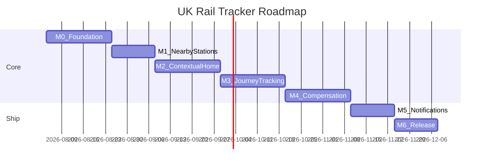
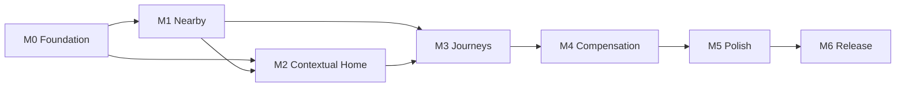

# Milestone Roadmap

Phased delivery plan for UK Rail Tracker. Each milestone produces a shippable debug build. Effort estimates assume solo, part-time development (~10–15 hours/week).

## Timeline overview

**Estimated total**: ~4–5 months to feature-complete v1.0.

---

## Feature priority map

| # | Feature | Milestone | Priority |
|---|---------|-----------|----------|
| — | Foundation (data, API, navigation) | M0 | Prerequisite |
| 1 | Nearest stations + detail + departures | M1 | P0 |
| 2 | Usual stations at this time + disruption + trains | M2 | P0 |
| 3 | Typical journeys A→B with live delay/disruption | M3 | P1 |
| 4 | Past disrupted journeys for compensation | M4 | P1 |
| — | Notifications and polish | M5 | P2 |
| — | Play Store release | M6 | P2 |

---

## M0 — Foundation

**Duration**: ~2–3 weeks  
**Goal**: Data and app skeleton that all features build on.

### Deliverables

- [ ] Import `stations.xml` → bundled asset → Room database with lat/lng spatial index
- [ ] API client abstraction (Retrofit or Ktor) with repository pattern
- [ ] API keys via `local.properties` → `BuildConfig` (never committed)
- [ ] Navigation shell: bottom nav with placeholder screens (Home, Nearby, Journeys, Settings)
- [ ] Location service wrapper: foreground permission, last-known location, permission-denied fallback
- [ ] DataStore for favourites: saved stations, saved journey pairs
- [ ] Shared UI components: loading, error, empty states in neon theme
- [ ] Add dependencies: Navigation Compose, ViewModel, coroutines, Room, DataStore, WorkManager

### Acceptance criteria

- [ ] App launches offline and can search/filter the full station list
- [ ] Tapping a station shows static detail from local DB (name, CRS, address, operator)
- [ ] Live departures API call succeeds for a hard-coded CRS code (e.g. `PAD`)
- [ ] Location permission flow works: grant → nearby sort; deny → manual search only
- [ ] `./gradlew :app:assembleDebug` succeeds with new dependencies

---

## M1 — Nearest stations + station detail

**Duration**: ~2 weeks  
**Priority**: P0  
**User story**: *"Show me the nearest stations, let me pick one, and see what's going on there."*

### Screens

| Screen | Behaviour |
|--------|-----------|
| **Nearby** | Stations sorted by GPS distance; show name, CRS, distance, operator; refresh on location update |
| **Station detail** | Static info (address, accessibility, station map URL, operator) + live departure board (next 10–15 departures: destination, time, platform, status, delay minutes) |
| **Search** | Filter all 2,612 stations by name or CRS code; recent searches persisted |

### Acceptance criteria

- [x] Standing at or near a real station, it appears in the top 3 nearby results
- [x] Departure board shows live data with correct delay/cancel indicators
- [x] Pull-to-refresh updates the board; stale data shows timestamp
- [x] Station detail renders accessibility info from bundled data
- [x] Search finds stations by partial name (e.g. "Kings" → King's Cross)

### Sub-milestone M1.1 (optional)

- Accessibility-first filter: step-free stations only, accessible toilets, etc.

---

## M2 — Contextual "my stations now"

**Duration**: ~2–3 weeks  
**Priority**: P0  
**User story**: *"When I open the app at my usual commute time, show me my stations, any disruption, and the next trains."*

### Features

| Feature | Behaviour |
|---------|-----------|
| **Routine inference (v1)** | User-defined commute windows (e.g. Mon–Fri 07:30–09:00 → Home station) + favourites weighted by time/day |
| **Home screen** | Surface 1–3 likely stations with disruption banner (green / amber / red) |
| **Departures at a glance** | Per station: next 3–5 trains with delay/cancel chips |
| **Disruption summary** | Tap banner → affected operators, reason, expected duration |
| **Background refresh** | WorkManager polls every 15 min on network available |

### Acceptance criteria

- [ ] At 08:15 on a configured weekday, home screen shows the user's morning station
- [ ] Active disruption at that station shows amber/red banner with summary text
- [ ] Next trains match live departure board data
- [ ] User can add/edit commute windows in Settings
- [ ] App refreshes home data in background without being open

### Sub-milestone M2.1 (optional)

- Android home-screen widget: next departures for primary commute station

---

## M3 — Journey tracking A→B

**Duration**: ~3 weeks  
**Priority**: P1  
**User story**: *"I travel between two stations regularly — show me the typical journeys, live status, and any delays or disruption."*

### Screens

| Screen | Behaviour |
|--------|-----------|
| **Journey planner** | Pick origin + destination (favourites, recents, search); show service options for chosen time |
| **Journey detail** | Per-leg: scheduled vs estimated arrival, platform, calling points, delay propagation |
| **Disruption on route** | Highlight cancelled legs, delays >15 min, missed-connection risk |
| **"My train" pin** | User selects a service; app tracks it with 30–60 s polling until arrival |

### Acceptance criteria

- [ ] Plan a journey (e.g. Paddington → Bristol Temple Meads) and see 3+ service options
- [ ] Live journey view updates estimated times while screen is open
- [ ] Cancelled or significantly delayed leg is visually flagged
- [ ] Pinned service persists across app background/foreground
- [ ] Recent journeys saved and accessible from Journeys tab

### Sub-milestone M3.1 (optional)

- Platform predictions based on historical patterns
- Share journey status link ("Running 12 min late")

---

## M4 — Disruption history + compensation

**Duration**: ~2–3 weeks  
**Priority**: P1  
**User story**: *"Show me journeys in the recent past that were disrupted so I can apply for compensation."*

### Features

| Feature | Behaviour |
|---------|-----------|
| **Automatic logging** | On journey completion: date, route, operator, scheduled/actual times, delay minutes, cancellation flag |
| **Disruption inbox** | List qualifying journeys from past 56 days (typical claim window) |
| **Compensation estimate** | Apply per-operator Delay Repay rules from [compensation-guide.md](compensation-guide.md) |
| **Claim assist** | Deep link to operator claim portal; export CSV summary |

### Acceptance criteria

- [ ] Completed journey with 35 min delay (GWR) appears in inbox as claimable
- [ ] Estimated refund shows correct percentage for the operator
- [ ] Tap "Claim" opens operator's Delay Repay page in browser
- [ ] User can dismiss or mark journeys as "claimed"
- [ ] Export produces CSV with date, route, operator, delay, estimated refund

### Sub-milestone M4.1 (optional)

- Season ticket pro-rata calculator
- Cumulative Delay Repay total vs season ticket cost

---

## M5 — Notifications and polish

**Duration**: ~2 weeks  
**Priority**: P2

### Deliverables

- [ ] Local notifications: delay on pinned journey, cancellation, "leave now" nudge
- [ ] Saved journey alerts (configurable: 15 / 30 min before departure)
- [ ] Offline cached last-known departure boards with "last updated" timestamp
- [ ] Consistent pull-to-refresh across all live-data screens
- [ ] Repository unit tests; UI tests for nearby → station detail → departure board flow
- [ ] Performance: home screen loads within 2 s on mid-range device

### Acceptance criteria

- [ ] Notification fires when pinned train delay exceeds 10 min
- [ ] Cached boards display when offline with clear staleness indicator
- [ ] No ANRs or jank on scroll-heavy screens (LazyColumn with 15+ departures)

---

## M6 — Release readiness

**Duration**: ~1–2 weeks  
**Priority**: P2

### Deliverables

- [ ] Release signing configuration (keystore, not committed)
- [ ] ProGuard / R8 rules for release build
- [ ] Privacy policy covering location usage and local journey history
- [ ] Play Store listing: screenshots, description, content rating
- [ ] CI: GitHub Actions running `./gradlew :app:assembleDebug` on PRs
- [ ] Closed beta via Play Console internal testing track

### Acceptance criteria

- [ ] `./gradlew :app:assembleRelease` produces signed APK/AAB
- [ ] Release build installs and runs on physical device
- [ ] Privacy policy linked from app Settings and Play Store listing
- [ ] CI passes on clean checkout

---

## Dependency graph

M2 can start before M1 is fully complete if station detail and departures are done, but M1's nearby/search should land first since M2 reuses those components.

---

## Risk register

| Risk | Impact | Mitigation |
|------|--------|------------|
| API rate limits on free tier | Stale or blocked live data | Cache aggressively; backoff; consider paid TransportAPI tier |
| Darwin credential approval delay | Blocks live data integration | Start Rail Data Marketplace registration early; `TransportApiDepartureRepository` as interim impl behind same interface |
| Operator Delay Repay rule changes | Wrong compensation estimates | Rules in config file, easy to update; disclaimer in UI |
| GPS accuracy indoors | Wrong "nearest" station | Show top 5 nearby; let user override via favourites |
| Background refresh battery drain | User uninstalls | 15 min interval; respect battery saver; user-configurable |
